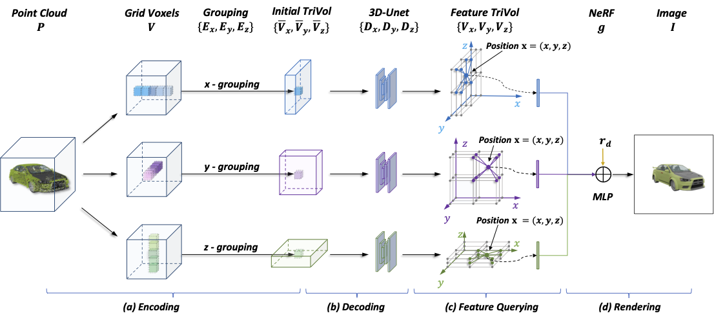
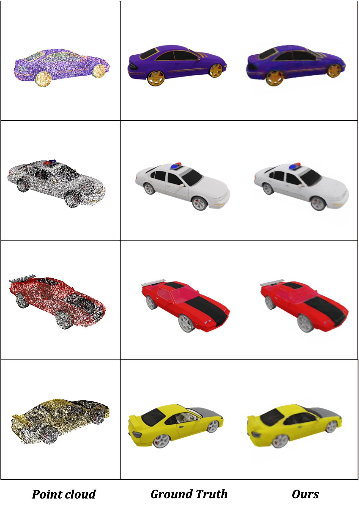
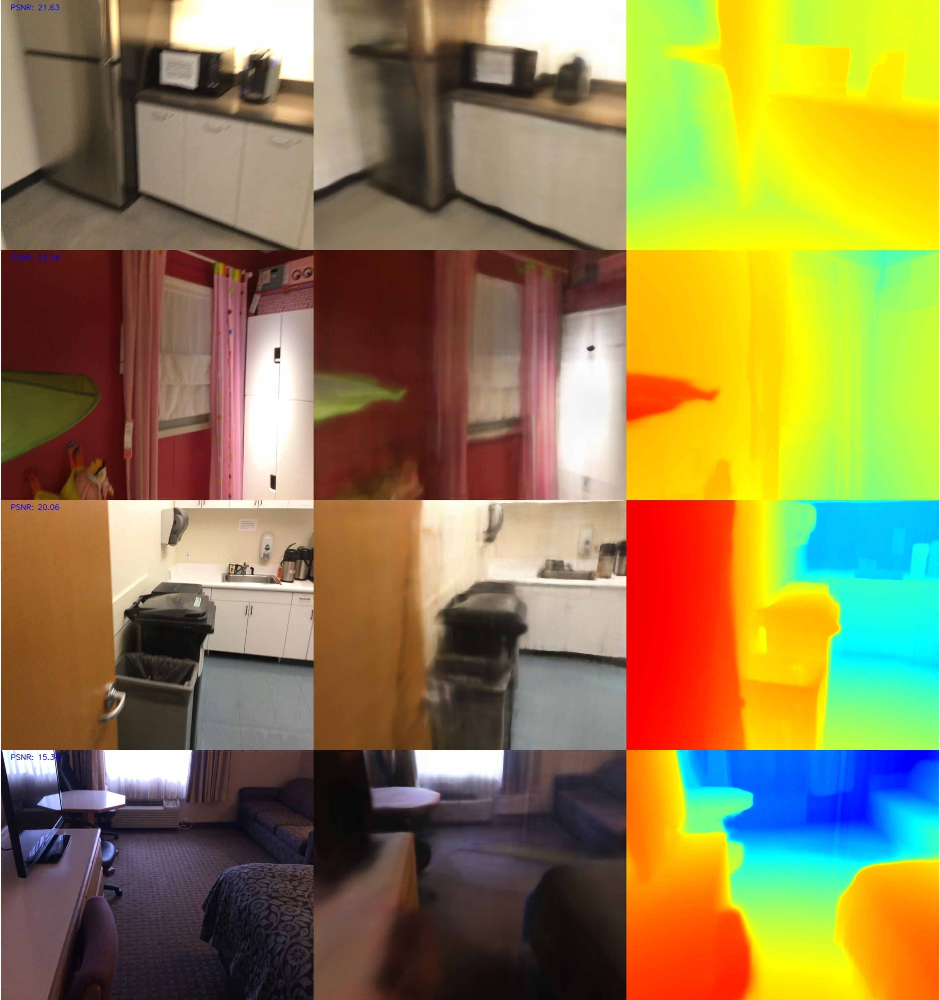

# TriVol: Point Cloud Rendering via Triple Volumes 

This is the source code of ["TriVol: Point Cloud Rendering via Triple Volumes" (CVPR-2023)](https://openaccess.thecvf.com/content/CVPR2023/papers/Hu_TriVol_Point_Cloud_Rendering_via_Triple_Volumes_CVPR_2023_paper.pdf).
<p float="left">
 
</p>

### Requirements (Tested on 4 * RTX3090)
- Linux
- Python == 3.8
- Pytorch == 1.13.0
- CUDA == 11.7

## Installation

### Install from environment.yml
You can directly install the requirements through:
```sh
$ conda env create -f environment.yml
```

### Or install packages seperately
* Create Environment
    ```sh
    $ conda create --name trivol python=3.8
    $ conda activate trivol
    ```

* Pytorch (Please first check your cuda version)
    ```sh
    $ conda install pytorch==1.13.0 torchvision==0.14.0 torchaudio==0.13.0 pytorch-cuda=11.7 -c pytorch -c nvidia
    ```
* [NerfAcc](https://github.com/KAIR-BAIR/nerfacc)
    ```sh
    $ pip install git+https://github.com/KAIR-BAIR/nerfacc.git
* [torch_scatter](https://github.com/rusty1s/pytorch_scatter)
    ```sh
    pip install torch-scatter -f https://data.pyg.org/whl/torch-1.13.0+cu117.html
    ```
* Other python packages: open3d, opencv-python, etc.

## Training
#### Training on the ShapeNet Car dataset
* Dataset:
  Download our processed ShapeNet Car from [OneDrive](https://mycuhk-my.sharepoint.com/:u:/g/personal/1155136880_link_cuhk_edu_hk/EZyZvj01XWdDvBE6zObiGAEB9Gc0HrG_Go9V5CaRi4wdVA?e=WC7C8m).
* Run: we recommand you run the code in multi-gpu mode.
    ```sh
    $ conda activate trivol
    $ python train.py \
            --scene_dir /path/to/shapenet \
            --dataset shapenet \
            --val_mode val \
            --max_epochs 200 \
            --lr 0.0005 \
            --batch_size 1 \
            --ngpus 4 \
            --feat_dim 16 \
            --patch_size 64 \
            --exp_name shapenet_car
    ```

* example results
    <p float="left">
     
    </p>


#### Training on the ScanNet dataset
* Dataset:
  Download and extract data from original [ScanNet-V2 preprocess](https://github.com/ScanNet/ScanNet/tree/master/SensReader/python).
* Run: we recommand you run the code in multi-gpu mode.
    ```sh
    $ conda activate trivol
    $ python train.py \
            --scene_dir /path/to/shapenet \
            --dataset scannet \
            --val_mode val \
            --max_epochs 500 \
            --lr 0.0005 \
            --batch_size 1 \
            --ngpus 4 \
            --feat_dim 16 \
            --patch_size 32 \
            --exp_name scannet
    ```
* example results
    <p float="left">
     
    </p>

## Contact
Tao Hu - [taohu@cse.cuhk.edu.hk](taohu@cse.cuhk.edu.hk)

## Citation
```
@InProceedings{Hu_2023_CVPR,
    author    = {Hu, Tao and Xu, Xiaogang and Chu, Ruihang and Jia, Jiaya},
    title     = {TriVol: Point Cloud Rendering via Triple Volumes},
    booktitle = {Proceedings of the IEEE/CVF Conference on Computer Vision and Pattern Recognition (CVPR)},
    month     = {June},
    year      = {2023},
    pages     = {20732-20741}
}
```